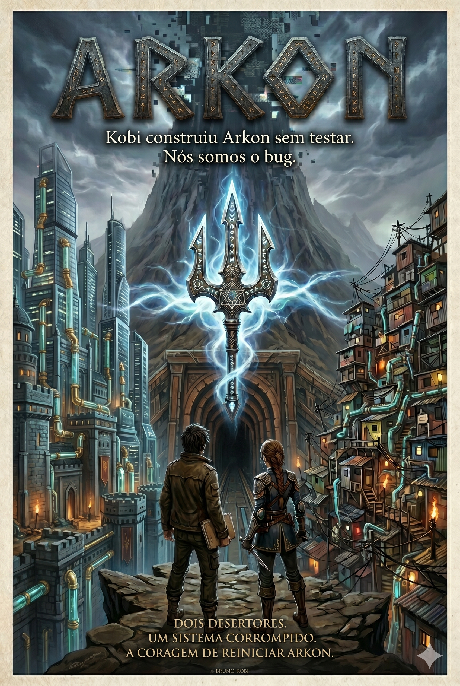

<div align="center">



# Arkon: A Fenda do Aglomerado

[](https://github.com/brunokobi/arkon-game)
[](https://react.dev)
[](https://vitejs.dev)
[](https://supabase.com)
[](https://netlify.com)
[](LICENSE)

📖 **[Ler o livro — ARKON Completo](docs/ARKON-Completo.pdf)**

</div>

---

## Sinopse

> *Kobi construiu Arkon sem testar.*
> *Nós somos o bug.*

Há séculos, um deus-engenheiro morreu para estabilizar o mundo que criou. Do sacrifício restou apenas a **Fenda** — uma cordilheira intransponível que partiu Arkon em dois — e o **Tridente**: a chave-mestra de um sistema que ninguém deveria conseguir empunhar.

Hoje, dois deuses se enfrentam a cada quatro anos pelo direito de controlar o que sobrou. Do lado oeste, **Molusk** governa pelos esgotos e pelos vazamentos que ele mesmo criou. Do lado leste, **Bolzarius** comanda aos gritos uma cidade construída sobre uma narrativa que ele próprio mandou escrever.

**Varen** é um desertor do Bonde da Base. Encontrou um arquivo que não deveria existir — e nele, três linhas que mudam tudo.

**Eira** é neta de Bolzarius. Foi formada para ser a herdeira perfeita do sistema, até salvar a vida do homem que seu próprio pai mandou ela eliminar.

Juntos descobrem que o Tridente esconde três comandos secretos que o próprio Kobi nunca documentou. E um deles pode unificar Arkon pela primeira vez na história.

Mas dois deuses sentem quando o terminal é tocado. E nenhum dos dois pretende deixá-los sair vivos da cordilheira.

*Uma fantasia política sobre o preço de descobrir como o mundo realmente funciona — e a coragem necessária para refazê-lo.*

---

## O Jogo

Browser game multiplayer 2D top-down no estilo Tibia — sátira política brasileira com nomenclatura nórdica/grega/romana.

| Facção | Deus | Território |
|---|---|---|
| **Bonde da Base** | Molusk, o Navis Novem | Skálholm (oeste) |
| **A Gestão** | Bolzarius, o Praetor Summus | Aetherion (leste) |
| **Os Autônomos** | — | Bifrost Inferior (neutro) |

## Stack

[](https://phaser.io)
[](https://zustand-demo.pmnd.rs)
[](https://nodejs.org)

| Camada | Tecnologia |
|---|---|
| Frontend | Phaser 3 + React + Vite |
| UI overlay | React + Zustand |
| Backend | Netlify Functions (serverless Node.js) |
| Banco | Supabase (PostgreSQL + Auth + Realtime) |
| Deploy | Netlify via GitHub |

## MVP — Progresso

- [x] Estrutura de pastas + dependências
- [x] Tela de login com parallax
- [x] Menu inicial com ficha do personagem
- [ ] Supabase: migrations + seed
- [ ] Auth real com Supabase
- [ ] Phaser: BootScene + WorldScene com tilemap
- [ ] Personagem se move + colide
- [ ] Posição sincronizada via Supabase Realtime
- [ ] Outros jogadores visíveis
- [ ] Combate básico + monstros com spawn
- [ ] Loot no banco
- [ ] Sistema de facção + Influência
- [ ] Missões do Arco 0

## Rodando localmente

```bash
git clone git@github.com:brunokobi/arkon-game.git
cd arkon-game
npm run dev        # sobe o client em http://localhost:5173
```

> Login de teste: `teste@arkon.io` / `arkon123`

## Documentação

Veja [`CLAUDE.md`](CLAUDE.md) para o contexto completo: lore, facções, personagens, geografia, classes, sistemas, eventos, missões e schema do banco.

---

<div align="center">
<sub>© 2026 Bruno Kobi · Estúdio de Jogos Arkon</sub>
</div>
